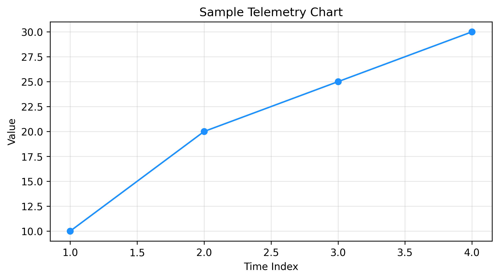

# ⚡ Grid Asset Anomaly Detector & Health Monitor

An industrial-grade telemetry analysis and unsupervised machine learning platform designed for high-voltage substation transformers, power grid converters, and critical electrical asset health monitoring.

[](https://gridassetanomalydetector-mgappkgiqfjvsffezuiw43v.streamlit.app/)
[](https://www.python.org/)
[](https://opensource.org/licenses/MIT)

---

## 🎯 Overview

As power grids experience higher stress from renewable integration and fluctuating loads, maintaining the reliability of critical substation assets becomes vital. Unexpected failures in transformers or converters lead to costly outages and extensive repair times.

**Grid Asset Anomaly Detector** is an AI-powered telemetry monitoring platform that applies unsupervised machine learning (Isolation Forest) to time-series operational data—such as active load, top-oil temperature, and mechanical vibration—to detect early anomaly patterns and prevent catastrophic equipment failures before they occur.

---

## 🚀 Key Features

* **Unsupervised Anomaly Detection:** Implements scikit-learn's Isolation Forest algorithm to isolate outlier operational states and identify potential internal faults.
* **Interactive Streamlit Dashboard:** Enables operators and power engineers to adjust simulation horizons, sensor noise levels, and expected anomaly contamination rates in real time.
* **Automated Telemetry Logging:** Features a robust SQLite database persistence layer to record sensor streams and flag anomalous events.
* **Rigorous Automated Testing:** Powered by Pytest to validate database operations, schema initialization, and machine learning logging pipelines.

---

## 📈 Visualizations & Analytical Reports

The platform automatically generates and logs comprehensive diagnostic visualizations and structured reports inside the `outputs/` directory:

* **`substation Asset Health Monitor.png` & `telemetry_chart.png`:** High-resolution matplotlib visualization charts mapping top-oil temperature time-series against isolation forest anomaly predictions to instantly identify thermal spikes and mechanical vibrations.
* **`asset_health_report.csv` & `asset_health_report.xlsx`:** Tabular exports containing complete telemetry logs, operational parameters, and anomaly flags for auditing and offline maintenance reporting.

### 🖼️ Preview of Visualizations & Tables

| Diagnostic Plot (`substation Asset Health Monitor.png`) | Telemetry Trend (`telemetry_chart.png`) |
| :---: | :---: |
|  |  |

---

## 📊 Live Dashboard Preview

Access the live application deployed on Streamlit Cloud:  
👉 **[Grid Asset Anomaly Detector Live App](https://gridassetanomalydetector-mgappkgiqfjvsffezuiw43v.streamlit.app/)**

---

## 🏗️ Repository Structure

```text
grid_asset_anomaly_detector/
├── database/
│   └── anomaly_db_logger.py         # SQLite telemetry and anomaly logging module
├── notebooks/
│   └── grid_asset_anomaly_detector.ipynb # Jupyter notebook for AI model prototyping
├── outputs/                         # Analytical reports and auto-saved plots
│   ├── asset_health_report.csv      # Exported CSV report of asset health logs
│   ├── asset_health_report.xlsx     # Exported Excel spreadsheet of analytical findings
│   ├── substation Asset Health Monitor.png # Visual health monitoring chart
│   └── telemetry_chart.png          # Telemetry and temperature anomaly plot
├── tests/
│   └── test_anomaly_detector.py     # Pytest unit tests for database and logging
├── app.py                           # Interactive Streamlit monitoring dashboard
├── requirements.txt                 # Project Python dependencies
└── README.md                        # Project documentation
